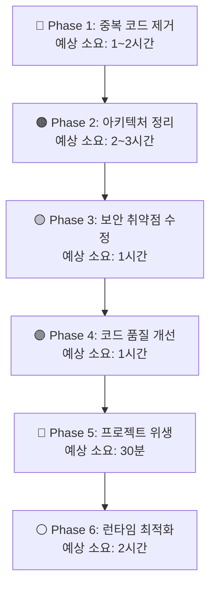

# 🔍 Agent Factory 종합 코드 리뷰 리포트

> 🐍 **"신용하지 않아. 코드는 거짓말을 하지 않으니까."**
> [Intelligence: Claude 4.6 Sonnet] — Iguro Obanai, Backend Architect

---

## 📋 분석 범위

| 영역 | 분석 파일 수 | 핵심 파일 |
|:-----|:----------:|:---------|
| Core Engine | 17개 | `agent_runner.py`, `llm_engine.py`, `dynamic_orchestrator.py` |
| Entry Points | 3개 | `agent_launcher.py`, `run_factory_cli.py`, `factory_manager.py` |
| Model Routing | 2개 | `model_utils.py`, `core/providers/registry.py` |
| Security | 3개 | `security_guard.py`, `destructive_guard.py`, `engine_auth.py` |
| Utils/Config | 4개 | `config_paths.py`, `utils.py`, `memory.py`, `tool_runtime.py` |
| Tests | 43개 | `tests/` 디렉토리 전체 |

---

## 🚨 발견된 문제점 (6대 카테고리, 18건)

---

### 카테고리 1: 🔴 심각한 코드 중복 (Critical Duplication)

#### 문제 1-1: `quick_guard` / `BANNED_IMPORT_TOPS` / `BANNED_CALLS` 3중 정의

| 파일 | 라인 |
|:-----|:----:|
| [agent_runner.py](file:///d:/hoonProJect/worktrees/agent-factory/core/agent_runner.py#L110-L148) | 110~148 |
| [security_guard.py](file:///d:/hoonProJect/worktrees/agent-factory/core/security_guard.py#L28-L80) | 28~80 |
| [utils.py](file:///d:/hoonProJect/worktrees/agent-factory/core/utils.py#L36) | 36 (re-export) |

**설명**: `quick_guard()` 함수와 `BANNED_IMPORT_TOPS`, `BANNED_CALLS` 상수가 `agent_runner.py`와 `security_guard.py`에 **완전히 동일한 코드로 두 번 정의**되어 있습니다. `utils.py`는 `security_guard.py`에서 re-export합니다.

```diff
# agent_runner.py (L110~148) — 이 코드 전체가 security_guard.py와 중복
-BANNED_IMPORT_TOPS = {
-    "os", "sys", "subprocess", "shutil", "importlib",
-    "pathlib", "glob", "ctypes",
-    "multiprocessing", "threading", "concurrent", "asyncio",
-}
-BANNED_CALLS = {"eval", "exec", "__import__", "compile", "input"}
-def quick_guard(code: str) -> tuple[bool, list[str]]:
-    ...  # 28줄 중복 코드
```

> [!CAUTION]
> 한쪽만 수정하면 다른쪽은 구버전 로직이 남습니다. 보안 모듈의 동기화 실패는 **보안 바이패스**(bypass)로 이어질 수 있습니다.

**수정 단계**:
1. `agent_runner.py`의 L110~148 전체 삭제
2. `agent_runner.py` 상단에 `from core.security_guard import quick_guard, BANNED_IMPORT_TOPS, BANNED_CALLS` 추가 (이미 `from core.utils import *`로 re-export되지만 명시적 import 권장)

---

#### 문제 1-2: `run_isolated()` 2중 정의

| 파일 | 라인 | 코드량 |
|:-----|:----:|:------:|
| [agent_runner.py](file:///d:/hoonProJect/worktrees/agent-factory/core/agent_runner.py#L161-L309) | 161~309 | **148줄** |
| [security_guard.py](file:///d:/hoonProJect/worktrees/agent-factory/core/security_guard.py#L86-L160) | 86~160 | **74줄** |

**설명**: `run_isolated()` 샌드박스 실행 함수가 양쪽에 다른 버전으로 존재합니다.
- `agent_runner.py` 버전: 더 정교한 네트워크 차단 + `socket.create_connection` 차단 + `_blocked_connect`에 `self` 파라미터 포함
- `security_guard.py` 버전: 더 간결하지만 `socket.create_connection` 차단 누락

**수정 단계**:
1. `security_guard.py`의 `run_isolated()`를 `agent_runner.py`의 최신 버전으로 통합 (네트워크 완전 차단 포함)
2. `agent_runner.py`의 L161~309 삭제
3. `agent_runner.py`에서 `from core.security_guard import run_isolated` 사용

---

#### 문제 1-3: `build_child_env()` 2중 정의

| 파일 | 라인 |
|:-----|:----:|
| [agent_runner.py](file:///d:/hoonProJect/worktrees/agent-factory/core/agent_runner.py#L150-L156) | 150~156 |
| [security_guard.py](file:///d:/hoonProJect/worktrees/agent-factory/core/security_guard.py#L163-L165) | 163~165 |

**수정 단계**: `agent_runner.py`의 `build_child_env` 삭제, `security_guard.py` 단일 사용.

---

#### 문제 1-4: `safe_id()` 3중 정의

| 파일 | 라인 |
|:-----|:----:|
| [utils.py](file:///d:/hoonProJect/worktrees/agent-factory/core/utils.py#L60-L64) | 60~64 |
| [tool_runtime.py](file:///d:/hoonProJect/worktrees/agent-factory/core/tool_runtime.py#L7-L11) | 7~11 |
| [config_paths.py](file:///d:/hoonProJect/worktrees/agent-factory/core/config_paths.py#L6-L10) | 6~10 (`_boot_safe_id`) |

**설명**: 동일한 ID 정규화 로직이 파일마다 복사됨. `tool_runtime.py`는 `core.utils`를 import하지 않고 독자적으로 정의.

**수정 단계**:
1. `tool_runtime.py`의 `safe_id` 삭제
2. `from core.utils import safe_id` 추가

---

### 카테고리 2: 🟠 아키텍처 문제 (Architecture Issues)

#### 문제 2-1: `agent_runner.py`의 God Object 패턴 (994줄)

**설명**: [agent_runner.py](file:///d:/hoonProJect/worktrees/agent-factory/core/agent_runner.py)가 **994줄**로, 다음 책임을 모두 담당합니다:

| 책임 | 라인 범위 | 별도 모듈 존재 여부 |
|:-----|:--------:|:--:|
| 보안 가드 (quick_guard 등) | 110~156 | ✅ security_guard.py에 이미 존재 |
| 샌드박스 실행 (run_isolated) | 161~309 | ✅ security_guard.py에 이미 존재 |
| 모델 라우팅 (ModelRouter) | 62~105 | ❌ 여기에만 존재 |
| 에이전트 실행 (AgentRunner) | 314~989 | ❌ 핵심 로직 |

**수정 단계**:
1. 중복 코드(보안 가드, 샌드박스) 삭제 → 약 **260줄 제거 가능**
2. `ModelRouter` 클래스를 `core/model_router.py`로 분리 (약 44줄)
3. `agent_runner.py`를 순수 `AgentRunner` 클래스만 담당하도록 정리 → **약 700줄 이하**

---

#### 문제 2-2: `from core.utils import *` 와일드카드 임포트

**파일**: [agent_runner.py L20](file:///d:/hoonProJect/worktrees/agent-factory/core/agent_runner.py#L20)

```python
from core.utils import *  # 어떤 심볼이 들어오는지 추적 불가
```

**위험성**: `utils.py`가 6개 하위 모듈의 심볼을 re-export하므로, import 시 **약 40개 이상의 심볼이 네임스페이스에 유입**됩니다. 의도치 않은 이름 충돌 위험.

**수정 단계**: 명시적 import로 전환

```python
from core.utils import safe_id, now_iso, read_yaml, write_yaml, ...
```

---

#### 문제 2-3: `config_paths.py`의 모듈 임포트 시 즉시 디렉토리 생성 (Side Effect)

**파일**: [config_paths.py L80~98](file:///d:/hoonProJect/worktrees/agent-factory/core/config_paths.py#L80-L98)

```python
# 모듈 import 시점에 16개 디렉토리를 즉시 생성
for d in [PROJECTS_DIR, GLOBAL_AGENTS_DIR, ...]:
    os.makedirs(d, exist_ok=True)
```

**위험성**: 테스트 실행 시에도 불필요한 디렉토리 생성. CI/CD 환경에서 예측 불가능한 부작용.

**수정 단계**:
1. `os.makedirs` 루프를 `ensure_directories()` 함수로 감싸기
2. 런타임 진입점에서만 명시적 호출

---

### 카테고리 3: 🟡 보안 취약점 (Security Issues)

#### 문제 3-1: 하드코딩된 "minesweeper" 프로젝트 특권

**파일**: [llm_engine.py L84~89](file:///d:/hoonProJect/worktrees/agent-factory/core/llm_engine.py#L84-L89)

```python
def _flash_auto_upgrade_enabled() -> bool:
    project_id = str(os.getenv("AGENT_PROJECT_ID", "") or "").strip().lower()
    if project_id:
        return project_id == "minesweeper"  # ❌ 특정 프로젝트명 하드코딩
    project_root = ...
    return project_root.endswith("/projects/minesweeper")  # ❌ 동일 문제
```

**설명**: 팩토리 코어 엔진에 특정 산출물(`minesweeper`) 이름이 하드코딩되어 있습니다.

> [!IMPORTANT]
> GEMINI.md 규칙 §1.3 **Absolute Context Isolation** 위반: 팩토리 엔진에서 특정 산출물 로직을 참조하면 안 됩니다.

**수정 단계**:
1. `_flash_auto_upgrade_enabled()`를 환경변수 `AGENT_FLASH_AUTO_UPGRADE=1`로 대체
2. 또는 `settings.yaml`의 `flash_auto_upgrade: true` 플래그로 프로젝트별 제어

---

#### 문제 3-2: `run_factory_cli.py`에서 `AGENT_DISABLE_ENGINE_API_KEYS=1` 기본 설정

**파일**: [run_factory_cli.py L62](file:///d:/hoonProJect/worktrees/agent-factory/run_factory_cli.py#L62)

```python
os.environ.setdefault("AGENT_DISABLE_ENGINE_API_KEYS", "1")  # ❌ 기본값으로 모든 API 키 비활성화
```

**설명**: CLI 엔트리포인트에서 API 키를 기본적으로 비활성화하면, 키가 있어도 사용 불가. 의도적이라면 주석 필요, 아니라면 제거.

**수정 단계**: 이 기본값의 의도를 명시하는 주석 추가 또는, CLI 모드에서도 API 키를 허용하도록 변경.

---

#### 문제 3-3: `security_guard.py`의 `run_isolated()`에서 `socket.create_connection` 차단 누락

**파일**: [security_guard.py L107~120](file:///d:/hoonProJect/worktrees/agent-factory/core/security_guard.py#L107-L120)

**설명**: `socket.socket.connect`만 차단하고 `socket.create_connection`은 차단하지 않아, `urllib` 등을 통한 네트워크 접근이 가능할 수 있습니다.

**수정 단계**: `agent_runner.py`의 더 완전한 네트워크 차단 로직을 `security_guard.py`로 통합

---

### 카테고리 4: 🟣 코드 품질 (Code Quality)

#### 문제 4-1: 깨진 인코딩 문자열 (Mojibake)

**파일**: [agent_runner.py L159](file:///d:/hoonProJect/worktrees/agent-factory/core/agent_runner.py#L159), [L795](file:///d:/hoonProJect/worktrees/agent-factory/core/agent_runner.py#L795)

```python
# L159: "3) Isolated Run (Lite) - -I ?좎?, -S ?쒓굅(pandas ?덉슜)"
#   → 한글이 깨진 주석. 원래: "-I 없이, -S 제거(pandas 허용)" 추정

# L795: print(f"?쨼 {cli_text}")
#   → 이모지("🤖")가 깨진 출력. UnicodeEncodeError 발생 가능
```

**수정 단계**:
1. L159 주석을 올바른 한글로 복원: `"3) Isolated Run (Lite) - -I 배제, -S 제거(pandas 허용)"`
2. L795의 깨진 문자를 `_safe_print(f"🤖 {cli_text}")` 또는 `print(f"[Bot] {cli_text}")` 같은 안전한 출력으로 교체

---

#### 문제 4-2: 미사용(Deprecated) 메서드 방치

**파일**: [agent_runner.py L457~463](file:///d:/hoonProJect/worktrees/agent-factory/core/agent_runner.py#L457-L463)

```python
def _make_tool_wrapper(self, func, ctx: dict):
    # Deprecated: Extracted to core.tool_runtime.ToolRuntimeWrapper
    return func

def _build_tool_functions(self, modules: list, ctx: dict, policy: dict) -> list:
    # Deprecated: Extracted to core.tool_runtime.ToolRuntimeWrapper
    return []
```

**설명**: `Deprecated` 주석이 있지만 삭제되지 않은 빈 메서드 2개.

**수정 단계**: 호출부가 없으므로 안전하게 삭제 가능.

---

#### 문제 4-3: `llm_engine.py`에서 `generate_json()` JSON 파싱 취약
 
**파일**: [llm_engine.py L190~195](file:///d:/hoonProJect/worktrees/agent-factory/core/llm_engine.py#L190-L195)

```python
if "```json" in text:
    json_block = text.split("```json")[1].split("```")[0].strip()
elif "```" in text:
    json_block = text.split("```")[1].split("```")[0].strip()  # ❌ 위험
```

**설명**: `elif "```"`의 경우, JSON이 아닌 Python/YAML 코드블록의 내용을 JSON으로 파싱 시도할 수 있습니다.

**수정 단계**: `elif` 분기에서 JSON 유효성 사전 검증 추가, 또는 정규표현식 `r'\{[\s\S]*\}'`로 JSON 객체를 직접 추출.

---

#### 문제 4-4: 하드코딩된 모델 버전 잔존

**파일**: 여러 곳

| 위치 | 하드코딩 |
|:-----|:---------|
| [llm_engine.py L66](file:///d:/hoonProJect/worktrees/agent-factory/core/llm_engine.py#L66) | `"models/gemini-2.0-flash"` |
| [agent_runner.py L101](file:///d:/hoonProJect/worktrees/agent-factory/core/agent_runner.py#L101) | `"gemini-2.5-pro"`, `"gemini-2.5-flash"`, `"gemini-2.0-pro"` |
| [agent_runner.py L722](file:///d:/hoonProJect/worktrees/agent-factory/core/agent_runner.py#L722) | `"gemini-1.5-flash"` |
| [agent_runner.py L851](file:///d:/hoonProJect/worktrees/agent-factory/core/agent_runner.py#L851) | `"gemini-2.5-flash"`, `"gemini-2.5-pro"` |

**설명**: GEMINI.md §5.5 **Self-Evolution** 원칙과 충돌. 모델 버전을 하드코딩하면 신규 모델 출시 시 코드 수정이 필요합니다.

**수정 단계**:
1. `model_utils.py`의 `get_dynamic_default_model()` / `resolve_dynamic_model()` 활용 일원화
2. 모든 하드코딩된 모델명을 `get_best_model()` 또는 `resolve_dynamic_model()` 호출로 대체

---

### 카테고리 5: 🔵 프로젝트 위생 (Project Hygiene)

#### 문제 5-1: 루트 디렉토리에 산재한 임시/디버그 파일

| 파일 | 크기 | 용도 |
|:-----|-----:|:-----|
| `debug_log.txt` | 55KB | 디버그 로그 |
| `debug_log2.txt` | 35KB | 디버그 로그 |
| `final_test_log.txt` | 11KB | 임시 테스트 로그 |
| `err.txt` | 2.7KB | 에러 로그 |
| `out.txt" | 14KB | 출력 결과 |
| `st_out.txt` | 27KB | 상태 출력 |
| `status.txt` / `status_short.txt` | 27KB/24KB | 상태 텍스트 |
| `nlm_answer.txt` | 12KB | NLM 응답 |
| `agent_launcher.py.bak` | 107KB | 백업 파일 |
| `pytest_output.txt` / `pytest_out.txt` | 39KB/3KB | pytest 출력 |

**수정 단계**:
1. `.gitignore`에 `*.log`, `*.bak`, `*_output.txt`, `debug_*.txt` 등 추가
2. 해당 파일들 삭제 및 Git에서 제거 (`git rm --cached`)

---

#### 문제 5-2: 루트 디렉토리의 테스트 파일 산재

| 파일 |
|:-----|
| `test_complex_skill_build.py` |
| `test_fallback.py` |
| `test_hashline.py` / `test_hashline_v2.py` |
| `test_hound_librarian.py` |
| `test_llm.py` |
| `test_model_routing_v3.py` |
| `test_terminal.py` |

**설명**: 7개의 테스트 파일이 `tests/` 디렉토리가 아닌 **프로젝트 루트**에 위치해 있습니다.

**수정 단계**:
1. 모든 `test_*.py`를 `tests/` 디렉토리로 이동
2. import 경로 수정

---

#### 문제 5-3: `run_factory_cli.py` L21의 "Logi-Mind" 하드코딩

**파일**: [run_factory_cli.py L21](file:///d:/hoonProJect/worktrees/agent-factory/run_factory_cli.py#L21)

```python
parser = argparse.ArgumentParser(description="Logi-Mind Agent Factory CLI")
#                                              ^^^^^^^^^ Context Isolation 위반
```

**수정 단계**: `"Agent Factory CLI"`로 변경.

---

### 카테고리 6: ⚪ 잠재적 런타임 문제 (Runtime Risks)

#### 문제 6-1: `LLMEngine`에서 `_gemini_keys` 전역 상태 + 스레드 안전성

**파일**: [llm_engine.py L21~22](file:///d:/hoonProJect/worktrees/agent-factory/core/llm_engine.py#L21-L22)

```python
_gemini_keys = []        # 전역 가변 리스트
_current_key_idx = 0     # 전역 가변 인덱스
```

**설명**: 멀티스레드/멀티에이전트 환경에서 `_current_key_idx`의 동시 접근이 Race Condition을 유발할 수 있습니다.

**수정 단계**: `threading.Lock()` 적용 또는, 싱글턴 패턴의 `KeyManager` 클래스로 캡슐화.

---

#### 문제 6-2: AI 분류기 호출의 불필요한 API 비용

**파일**: [agent_runner.py L709~734](file:///d:/hoonProJect/worktrees/agent-factory/core/agent_runner.py#L709-L734)

**설명**: **모든 작업 실행 시마다** Gemini Flash API를 호출하여 "complex vs simple" 판별을 수행합니다. GEMINI.md §1의 **수익성 보호 (AI Funnel)** 원칙인 "Stage 1은 Rule-based"와 모순됩니다.

**수정 단계**:
1. **Stage 1**: 간단한 Rule-based 분류 먼저 수행 (길이, 키워드, 역할 등)
2. **Stage 2**: Rule-based로 판별 불가한 경우에만 AI 분류기 호출
3. 분류 결과를 캐시하여 동일/유사 작업 반복 시 재사용

---

## 📊 수정 우선순위 로드맵



### Phase 1: 중복 코드 제거 (긴급, 보안 위험)
1. `agent_runner.py`에서 `quick_guard`, `BANNED_*`, `run_isolated`, `build_child_env` 삭제 → **~260줄 제거**
2. `tool_runtime.py`의 `safe_id` 삭제 → `core.utils`에서 import

### Phase 2: 아키텍처 정리
1. `ModelRouter`를 `core/model_router.py`로 분리
2. `from core.utils import *` → 명시적 import로 전환
3. `config_paths.py`의 Side Effect 제거 (`ensure_directories()` 함수화)

### Phase 3: 보안 취약점 수정
1. `_flash_auto_upgrade_enabled()`의 하드코딩 제거 → 환경변수/설정 파일화
2. `security_guard.py`에 `socket.create_connection` 차단 추가
3. CLI의 `AGENT_DISABLE_ENGINE_API_KEYS` 기본값 검토

### Phase 4: 코드 품질 개선
1. Mojibake(깨진 문자열) 수정
2. Deprecated 메서드 삭제
3. `generate_json()` 파싱 로직 강화
4. 하드코딩된 모델 버전 → 동적 선택으로 전환

### Phase 5: 프로젝트 위생
1. 루트의 임시/디버그 파일 정리
2. 루트의 테스트 파일 → `tests/` 이동
3. "Logi-Mind" 하드코딩 제거 (Context Isolation)

### Phase 6: 런타임 최적화
1. `_gemini_keys` 스레드 안전성 확보
2. AI Funnel Stage 1 Rule-based 분류기 추가 (API 비용 절감)

---

## 🔑 핵심 요약

| 심각도 | 건수 | 대표 문제 |
|:------:|:---:|:---------|
| 🔴 Critical | 4 | 코드 3중 중복, 보안 모듈 분기 |
| 🟠 Major | 3 | God Object, 와일드카드 import, side-effect |
| 🟡 Security | 3 | 하드코딩 특권, API 키 비활성화, 네트워크 차단 누락 |
| 🟣 Quality | 4 | Mojibake, 미사용 코드, JSON 파싱, 모델 하드코딩 |
| 🔵 Hygiene | 3 | 임시파일, 테스트 위치, Context Isolation |
| ⚪ Runtime | 2 | 스레드 안전성, AI 비용 최적화 |

> **총 18건의 문제 확인. Phase 1 (중복 제거)만 수행해도 약 260줄을 제거하여 유지보수성이 크게 개선됩니다.**
